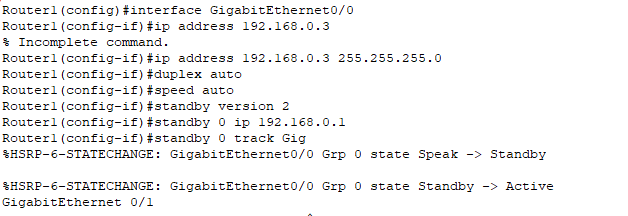

# Домашнее задание к занятию 1 «Disaster recovery и Keepalived» - Белов Антон


### Задание 1

- Дана [схема](1/hsrp_advanced.pkt) для Cisco Packet Tracer, рассматриваемая в лекции.
- На данной схеме уже настроено отслеживание интерфейсов маршрутизаторов Gi0/1 (для нулевой группы)
- Необходимо аналогично настроить отслеживание состояния интерфейсов Gi0/0 (для первой группы).
- Для проверки корректности настройки, разорвите один из кабелей между одним из маршрутизаторов и Switch0 и запустите ping между PC0 и Server0.
- На проверку отправьте получившуюся схему в формате pkt и скриншот, где виден процесс настройки маршрутизатора.

Процесс настройки маршрутизатора Router0



Процесс настройки маршрутизатора Router1


Скриншот получившейся схемы и ссылка на файл в формате pkt (Cisco packet tracer)


https://github.com/Toha-B/sysdb-/blob/main/scrshts/10_1/hsrp_advanced.pkt

### Задание 2

- Запустите две виртуальные машины Linux, установите и настройте сервис Keepalived как в лекции, используя пример конфигурационного [файла](1/keepalived-simple.conf).
- Настройте любой веб-сервер (например, nginx или simple python server) на двух виртуальных машинах
- Напишите Bash-скрипт, который будет проверять доступность порта данного веб-сервера и существование файла index.html в root-директории данного веб-сервера.

```
#!/bin/bash
if [[ $(netstat -tulpn | grep LISTEN | grep :80) ]] && [[ -f /var/www/html/index.nginx-debian.html ]]; then
exit 0
else
exit 1
fi
```

- Настройте Keepalived так, чтобы он запускал данный скрипт каждые 3 секунды и переносил виртуальный IP на другой сервер, если bash-скрипт завершался с кодом, отличным от нуля (то есть порт веб-сервера был недоступен или отсутствовал index.html). Используйте для этого секцию vrrp_script


- На проверку отправьте получившейся bash-скрипт и конфигурационный файл keepalived, а также скриншот с демонстрацией переезда плавающего ip на другой сервер в случае недоступности порта или файла index.html

https://github.com/Toha-B/sysdb-/blob/main/scrshts/10_1/keepalived.conf
