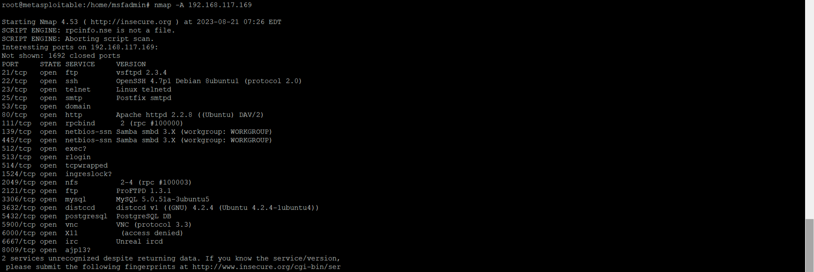
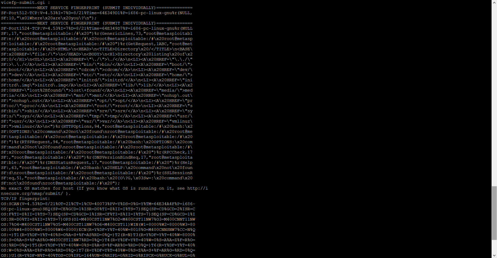
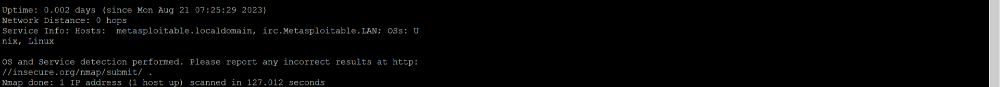

# Домашнее задание к занятию «Уязвимости и атаки на информационные системы» - Белов Антон

### Задание 1

Скачайте и установите виртуальную машину Metasploitable: https://sourceforge.net/projects/metasploitable/.

Это типовая ОС для экспериментов в области информационной безопасности, с которой следует начать при анализе уязвимостей.

Просканируйте эту виртуальную машину, используя **nmap**.

Попробуйте найти уязвимости, которым подвержена эта виртуальная машина.

Сами уязвимости можно поискать на сайте https://www.exploit-db.com/.

Для этого нужно в поиске ввести название сетевой службы, обнаруженной на атакуемой машине, и выбрать подходящие по версии уязвимости.

Ответьте на следующие вопросы:

- Какие сетевые службы в ней разрешены?

  Какие сетевые службы в ней разрешены?

Разрешенные сетевые службы - те, у которых открыты порты, их можно наблюдать в первом скриншоте (практически в самом начале вывода на экран результатов работы утилиты nmap). В нашем случае - это протоколы сетевого уровня:
- DNS - доменный сервер имен, на скриншоте показан как domain, порт 53;
- ftp - протокол передачи файлов между хостами по сети;
- http - протокол передачи данных;
- smtp - сетевой протокол, предназначенный для передачи электронной почты;
- ssh и telnet - сетевые протоколы, позволяющие проводить удаленное управление хостами;
- ajp13  - протокол Apache для обработки входящих сообщений с веб-серверами;
- irc - протокол обмена сообщениями. 

- Какие уязвимости были вами обнаружены? (список со ссылками: достаточно трёх уязвимостей)

(https://vulners.com/search?query=CVE-2011-2523  
 https://vulners.com/search?query=smtp-vuln-cve2010-4344  
 https://vulners.com/search?query=CVE-2011-3192  ) 

### Задание 2

Проведите сканирование Metasploitable в режимах SYN, FIN, Xmas, UDP.

Запишите сеансы сканирования в Wireshark.

Ответьте на следующие вопросы:

- Чем отличаются эти режимы сканирования с точки зрения сетевого трафика?
- Как отвечает сервер?

*Приведите ответ в свободной форме.*
