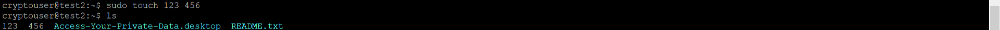

# Домашнее задание к занятию  «Защита хоста» - Белов Антон

### Задание 1

 Установите **eCryptfs**.
 
 Добавьте пользователя cryptouser.
 
  
  
 Зашифруйте домашний каталог пользователя с помощью eCryptfs.

  

  

  

### Задание 2

 Установите поддержку **LUKS**.
 Создайте небольшой раздел, например, 100 Мб. 
[2-1](./scrshts/13_2/tz_2.1.png)

 Создайте небольшой раздел, например, 100 Мб.
 Зашифруйте созданный раздел с помощью LUKS.

## Дополнительные задания (со звёздочкой*)

Эти задания дополнительные, то есть не обязательные к выполнению, и никак не повлияют на получение вами зачёта по этому домашнему заданию. Вы можете их выполнить, если хотите глубже шире разобраться в материале

### Задание 3 *

1. Установите **apparmor**.
2. Повторите эксперимент, указанный в лекции.
3. Отключите (удалите) apparmor.

*В качестве ответа пришлите снимки экрана с поэтапным выполнением задания.*

